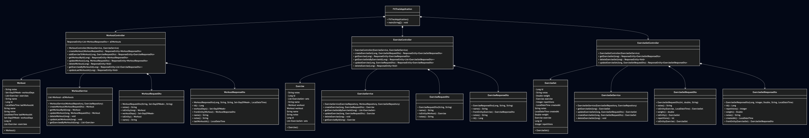
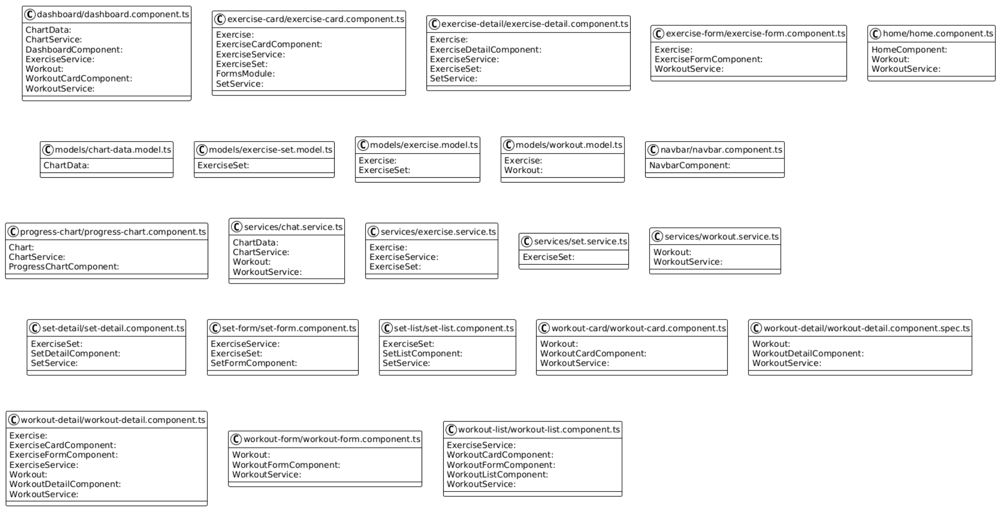

# Team 6 - Skibidi Coders - FitTrack

## Running the application
The application was optimized to run with docker.

Run the following command in your terminal in the root directory of the project:
```bash
docker compose up -d
```

Afterward, navigate to `http://localhost` and you should see the web app running.

## Testing the application

### Backend
Navigate to the `server` directory and run the following command:
```bash
./gradlew test
```

### Frontend
Navigate to the `client` directory and run the following command:
```bash
npm run test
```

## Class Description

### Controllers

#### `ExerciseController`

The `ExerciseController` handles the management of exercises in the system. It provides endpoints for:
- Retrieving an exercise by its ID (`GET /api/exercises/{id}`)
- Creating a new exercise and adding it to a workout (`POST /api/exercises/{id}/sets`)
- Updating an existing exercise (`PUT /api/exercises/{id}`)
- Deleting an exercise (`DELETE /api/exercises/{id}`)
- Retrieving all sets associated with an exercise (`GET /api/exercises/{id}/sets`)

#### `ExerciseSetController`

The `ExerciseSetController` manages the exercise sets. The endpoints include:
- Retrieving an exercise set by its ID (`GET /api/sets/{id}`)
- Creating a new exercise set (`POST /api/exercises/{id}/sets`)
- Updating an exercise set (`PUT /api/sets/{id}`)
- Deleting an exercise set (`DELETE /api/sets/{id}`)

#### `WorkoutController`

The `WorkoutController` provides endpoints for managing workouts:
- Retrieving all workouts (`GET /api/workouts`)
- Retrieving a workout by its ID (`GET /api/workouts/{id}`)
- Creating a new workout (`POST /api/workouts`)
- Updating an existing workout (`PUT /api/workouts/{id}`)
- Deleting a workout (`DELETE /api/workouts/{id}`)
- Retrieving all exercises of a workout (`GET /api/workouts/{id}/exercises`)
- Adding an exercise to a workout (`POST /api/workouts/{id}/exercises`)
- Updating the last workout date (`PATCH /api/workouts/{id}`)

### DTOs (Data Transfer Objects)

#### `ExerciseRequestDto`

This DTO is used for creating or updating exercises. It includes:
- `name`: The name of the exercise
- `notes`: Additional notes for the exercise

#### `ExerciseSetRequestDto`

This DTO is used for creating or updating an exercise set. It includes:
- `repetitions`: The number of repetitions in the set
- `weight`: The weight used in the set
- `notes`: Additional notes for the exercise set

#### `WorkoutRequestDto`

This DTO is used for creating or updating a workout. It includes:
- `name`: The name of the workout
- `workoutDays`: The days of the week the workout is scheduled
- `notes`: Additional notes for the workout

#### `ExerciseResponseDto`

This DTO is used for returning exercise information in response to API requests. It includes:
- `id`: The ID of the exercise
- `name`: The name of the exercise
- `notes`: The notes associated with the exercise

#### `ExerciseSetResponseDto`

This DTO is used for returning exercise set information in response to API requests. It includes:
- `id`: The ID of the exercise set
- `repetitions`: The number of repetitions
- `weight`: The weight lifted
- `notes`: Notes related to the exercise set
- `createdAt`: The creation timestamp of the exercise set

#### `WorkoutResponseDto`

This DTO is used for returning workout information in response to API requests. It includes:
- `id`: The ID of the workout
- `name`: The name of the workout
- `workoutDays`: The days of the week the workout is scheduled
- `lastWorkoutAt`: The date and time of the last workout
- `notes`: The notes associated with the workout

### Entities

#### `Exercise`

The `Exercise` entity represents an exercise in the system. It contains the following properties:
- `id`: The ID of the exercise
- `name`: The name of the exercise
- `notes`: Notes about the exercise
- `workout`: A reference to the workout this exercise belongs to
- `sets`: A list of exercise sets associated with the exercise

#### `ExerciseSet`

The `ExerciseSet` entity represents a set performed during an exercise. It contains:
- `id`: The ID of the exercise set
- `repetitions`: The number of repetitions performed
- `weight`: The weight lifted in the set
- `createdAt`: The timestamp of when the exercise set was created
- `notes`: Any notes associated with the exercise set
- `exercise`: A reference to the exercise this set belongs to

#### `Workout`

The `Workout` entity represents a workout routine. It contains:
- `id`: The ID of the workout
- `name`: The name of the workout
- `workoutDays`: The days of the week the workout is scheduled
- `lastWorkoutAt`: The date and time of the last workout
- `notes`: Additional notes for the workout
- `exercises`: A list of exercises included in the workout

### Services

#### `ExerciseService`

The `ExerciseService` manages the core logic for exercises. It includes methods for:
- Retrieving exercises by ID
- Creating, updating, and deleting exercises
- Fetching exercise sets associated with an exercise

#### `ExerciseSetService`

The `ExerciseSetService` manages the logic for exercise sets. It includes methods for:
- Creating, updating, and deleting exercise sets
- Retrieving exercise sets by ID

#### `WorkoutService`

The `WorkoutService` manages the logic for workouts. It includes methods for:
- Creating, updating, and deleting workouts
- Retrieving workouts by ID
- Fetching exercises associated with a workout
- Updating the last workout date

### Repositories

Repositories are used to interact with the database and manage entities. They include:
- `ExerciseRepository`: For managing `Exercise` entities
- `ExerciseSetRepository`: For managing `ExerciseSet` entities
- `WorkoutRepository`: For managing `Workout` entities
## UML Class Diagram
Below is a graphical representation of the class structure:



And the class structure of the angular application. It just shows the most important components without dependencies.




This diagram visually outlines the relationships between the key classes and their interactions.

## Why We Chose This Architecture

The architecture of the FitTrack application is based on modern software design principles, emphasizing scalability, maintainability, and flexibility. The application was structured with a layered architecture that divides the system into distinct responsibilities: Controllers, Services, and Repositories. This decision was made to enhance the organization and long-term viability of the system, ensuring it can evolve and scale as needed. Here’s a deeper dive into why we chose this approach:

### 1. **Separation of Concerns (SoC)**

One of the main reasons for selecting this architecture is the principle of **Separation of Concerns** (SoC). By keeping different components isolated in separate layers, the application becomes easier to understand, maintain, and extend. In this case:

- **Controllers** handle the API endpoints and HTTP requests. Their primary responsibility is to map incoming requests to the appropriate service methods.
- **Services** encapsulate the business logic of the application. They manage the core functionality, such as creating and updating workouts, exercises, and sets, ensuring that all business rules are respected.
- **Repositories** manage the data persistence layer, interacting with the database to fetch, save, and update entities. The repository pattern allows for better separation from the actual business logic, providing a cleaner abstraction layer for database operations.

This separation enables each part of the system to evolve independently without causing issues in other parts. For instance, if the business logic changes, we can modify the services layer without altering how the controller interacts with the API or how the data is stored.

### 2. **Scalability and Flexibility**

A layered architecture is inherently **scalable**. As the system grows, this design allows you to scale each layer individually. For example, if the workout data grows significantly and performance becomes a concern, we can optimize the **repository** layer with database indexing, caching, or horizontal scaling without impacting the business logic or API layer. Similarly, if the demand for new features arises—such as integrating third-party fitness tracking services or enhancing the workout plans—these can be added to the service layer while leaving the other layers untouched.

This separation also provides flexibility when dealing with different user requirements. For example, the system can be easily extended to support multi-user capabilities, user authentication, or different workout plans tailored to specific fitness levels. Because the architecture cleanly separates concerns, new features can be added with minimal disruption to the existing system.

### 3. **Maintainability**

By organizing the application into clear layers, the code becomes more maintainable. With each responsibility isolated, developers can focus on specific concerns without needing to understand the entire application. For example, if a bug is identified in the workout creation process, we can isolate the problem to either the controller, service, or repository layers, speeding up the debugging and fixing process.

Additionally, the use of **DTOs (Data Transfer Objects)** helps decouple the internal representation of the data (i.e., entities) from the data exposed to external consumers. This allows for flexibility when changing the structure of the data without affecting the client-side or the external API consumers. If the internal data structure needs to change, we can simply update the service layer or DTOs, and the rest of the system remains unaffected.

The use of a repository layer also makes database interaction easier to maintain. If, for instance, there’s a need to switch from one database to another (e.g., from SQL to NoSQL), the repository layer provides a single point of change, minimizing the impact on the rest of the application.

### 4. **Testability**

The layered architecture makes it easier to write tests for individual components. By isolating the different layers, we can test the application at multiple levels:

- **Unit tests** can be written for the service layer to ensure that the business logic behaves as expected. These tests can focus solely on the core functionality, mocking out external dependencies like the repository or controller.
- **Integration tests** can be written for the controller layer to ensure that the API behaves correctly and communicates with the service layer as expected.
- **Repository tests** can be used to verify that data is correctly saved and retrieved from the database.

This structured approach enables comprehensive testing of each layer without the need to test everything all at once. As a result, we achieve higher test coverage, better confidence in the correctness of the system, and an easier way to identify and fix issues as they arise.

### 5. **Future-Proofing the Application**

The layered architecture is designed to be **future-proof**. It allows us to extend the system without significant restructuring. For example, as fitness-tracking technologies evolve, we can integrate new workout types, support for different measurement units, or additional metadata without overhauling the existing system. 

Since business logic resides in the service layer, it remains independent of external changes, like the introduction of new exercise tracking devices or changes to fitness-related APIs. Adding new data sources or integrating them into the system can be done by extending or adding new services, without disrupting existing functionality.

Additionally, the architecture supports the addition of new features, such as personalized workout recommendations, performance analytics, or progress tracking, without significantly affecting the core structure. As the needs of the users or the business evolve, the application can evolve in a structured, organized manner.

### 6. **Clear API Structure**

The architecture also helps ensure that the API is **well-structured** and **easy to understand**. By clearly separating the concerns between controllers (API routes) and services (business logic), we can build a RESTful API that is consistent and easy to maintain. Each API endpoint corresponds directly to a service method, which handles the core logic. This approach makes it easier for front-end developers or third-party consumers to understand how to interact with the system.

### Conclusion

The decision to adopt this layered architecture aligns with modern best practices in web application development. The separation of concerns provides clarity, maintainability, and flexibility, ensuring that the application can be extended and scaled as the needs grow. The architecture facilitates future feature addition, provides a clean structure for testing, and supports the ease of integrating new technologies as the domain of fitness tracking evolves. This structured approach ensures that FitTrack can continue to grow and adapt without becoming overly complex or difficult to manage.

## Test Concept
A structured test approach is followed to ensure code quality and correctness. The test strategy includes:

### Unit Tests
[Link to the Testsconept with all Unit Tests](./documents/TestConcept.md)

### Test Execution
Tests are executed automatically using Gradle:
```sh
./gradlew test
```
A test coverage report is generated to ensure all critical functionality is tested.

This structured test approach ensures the reliability and correctness of the system while supporting future development and refactoring efforts.

## Branching-Model

For the development of this project, a **Feature-Branch-Workflow** is used. This ensures that changes are systematically integrated into the main project and enables clean version control.

### Main Branches
The repository uses two main branches:

- **`main`**: Contains the currently stable and tested code. All final changes are merged here.
- **`develop`**: This branch is used for integrating new features before the final merge. It holds the current development state and should always be functional.

### Feature Branches
New features or major changes are developed in separate feature branches. The naming convention for feature branches is:

```
feat/<feature-name>
```

Examples:
- `feat/add-workout-component`
- `feat/update-patch-request`

### Bugfix Branches
Bug fixes are developed in separate branches and then merged into `develop`. The naming convention for bugfix branches is:

```
fix/<bug-description>
```

Examples:
- `fix/change-return-value`

### Branching Workflow
1. **Creating a Feature Branch**  
   If a new feature is being developed:
   ```sh
   git checkout -b feat/<feature-name> develop
   ```

2. **Development and Commit Rules**  
   - All commits must have a clear description.  
   - Feature commits start with `feat:`, e.g.:
     ```sh
     git commit -m "feat: add-workout-component`"
     ```
   - Bugfix commits start with `fix:`, e.g.:
     ```sh
     git commit -m "fix: update-patch-request"
     ```

3. **Merge via Pull Request**  
   - Once a feature/bugfix is completed, a Pull Request (PR) is created against `develop`.  
   - This PR must not be reviewed. The review will be done with de PR against `main`.
   - If further changes are required, they are added via additional commits in the feature branch.

4. **Merging into `main` (Release Phase)**  
   - After successful testing and stabilization, `develop` is merged into `main`.  
   - This is done via a Pull Request:  
     ```sh
     git checkout main
     git merge develop
     git push origin main
     ```

### Summary of Branch Names
| Type        | Naming Convention        | Example                         |
|------------|------------------------|---------------------------------|
| Main Branch | `main`                  | `main`                          |
| Development Branch | `develop`       | `develop`                       |
| Feature | `feat/<feature-name>`       | `feat/add-workout-component`  |
| Bugfix | `fix/<bug-description>`      | `fix/change-return-value` |

This branching model ensures that changes are properly integrated, tested, and tracked.

## PR Discussions
[Pull Request #65](https://github.zhaw.ch/PM2-IT24taZH-meea-lieh-kars/team06-skibidi-coders-projekt2-fittrack/pull/65)
[Pull Request #68](https://github.zhaw.ch/PM2-IT24taZH-meea-lieh-kars/team06-skibidi-coders-projekt2-fittrack/pull/68)

## Familiarity
### Why we used Angular instead of React as mentioned in "Projektskizze"
We chose Angular over React primarily due to our team’s existing knowledge and experience with Angular. Since Angular provides a comprehensive, opinionated framework with built-in tools like routing, form handling, and dependency injection, it allowed us to quickly build and maintain the application. Additionally, Angular’s strong TypeScript integration and structured architecture made it easier for us to manage large-scale applications. React, while powerful, requires more customization and additional libraries for similar functionality, which was not necessary given our team’s familiarity with Angular.
